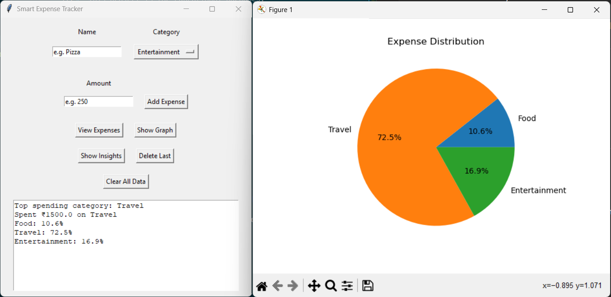

# 💰 Smart Expense Tracker


> A simple and interactive desktop app to track and analyze daily expenses.

## 🖥️ Application Preview

The application provides an intuitive interface to:
- Add and manage expenses
- Visualize spending patterns
- Monitor budget usage in real time

---

## 📌 Problem Statement

Many students and individuals do not track their daily expenses, leading to overspending and poor financial management. There is a need for a simple, user-friendly system that helps users monitor, analyze, and control their spending habits.

---

## 🎯 Solution

The **Smart Expense Tracker** provides:

* Easy expense recording
* Categorization of spending
* Visual insights through graphs
* Budget monitoring with alerts
* Better understanding of financial habits

---

## 🚀 Features

* ➕ Add new expenses with name, category, and amount
* 📋 View all recorded expenses
* 📊 Visualize expenses using pie charts
* 💡 Get insights on spending patterns
* 💰 Budget tracking with alerts
* 🗂️ Category-wise expense summary
* 📅 Monthly expense tracking
* 🧹 Clear all expense data
* ❌ Delete last added expense
* 📝 Custom category support ("Other" option)
* 🎯 User-friendly UI with placeholders and structured layout

---

## 🛠️ Tech Stack

* **Python**
* **Tkinter** (GUI)
* **Matplotlib** (Data Visualization)
* **CSV** (Data Storage)

---

## 📦 Requirements

* Python 3.x
* matplotlib

Install dependencies:

```
pip install -r requirements.txt
```

---

## 📁 Project Structure

```
expense_tracker/
│
├── app.py                 # Main UI application
├── expense_tracker.py     # Core logic (add/view/delete/summary)
├── graph.py               # Graphs and insights
├── config.py              # Budget configuration
├── requirements.txt       # Dependencies
├── .gitignore             # Ignored files
├── expenses.csv           # Data file (auto-created)
├── README.md              # Project documentation
```

---

## ⚙️ Installation & Setup

### 1. Clone the repository

```
git clone https://github.com/riyaacodes/personal-expense-tracker.git
cd personal-expense-tracker
```

### 2. Install dependencies

```
pip install -r requirements.txt
```

### 3. Run the application

```
python app.py
```

---

## 🧑‍💻 How to Use

1. Enter:

   * Expense Name
   * Category (or select **Other** to enter custom category)
   * Amount

2. Click **"Add Expense"**

3. Use buttons to:

   * View all expenses
   * Show graph (expense distribution)
   * Get insights
   * Delete last entry
   * Clear all data

4. If total exceeds budget → ⚠️ alert is displayed

---

## 📊 Example Insights

* Top spending category
* Percentage distribution of expenses
* Total expense summary

---

## ✨ Key Highlights

* Modular and well-structured code
* Real-world problem solving (expense management)
* Interactive GUI using Tkinter
* Data visualization with meaningful insights
* Budget monitoring system

---

## 🔮 Future Improvements

* 📉 Advanced analytics and predictions
* 👤 Multi-user support
* 🗄️ Database integration (SQLite/MySQL)
* 🌐 Web version (Flask/Django)
* 📤 Export to Excel/PDF
* 🎨 Enhanced UI (dark mode, tables)

---

## 📚 What I Learned

* File handling using CSV
* GUI development using Tkinter
* Data visualization with Matplotlib
* Writing modular and maintainable code
* Solving real-world problems using programming

---

## 🤝 Contribution

This is an academic project. Suggestions and improvements are welcome!

---

## 📜 License

This project is for educational purposes.
